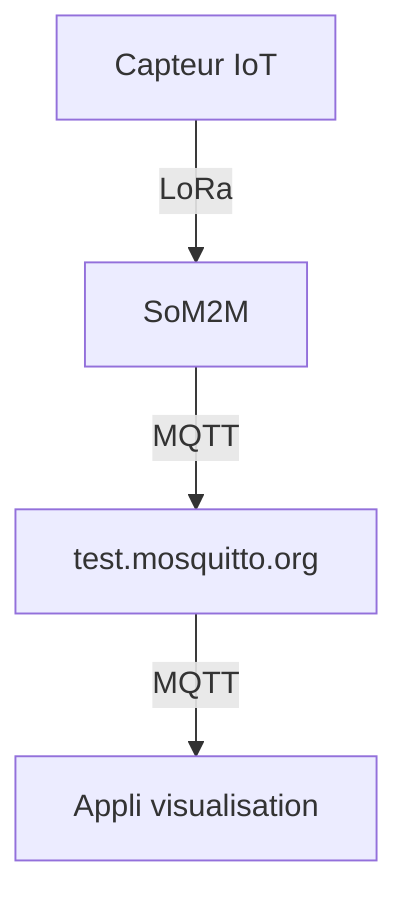

# test_app_iot, goudot
projet IoT goudot démontration...

## Etapes
1) Connection MQTT (lib paho)
2) S'abonner au topic "cci/SenseCAP"
3) Quand un message arrive, le décoder
4) Afficher les informations du capteur