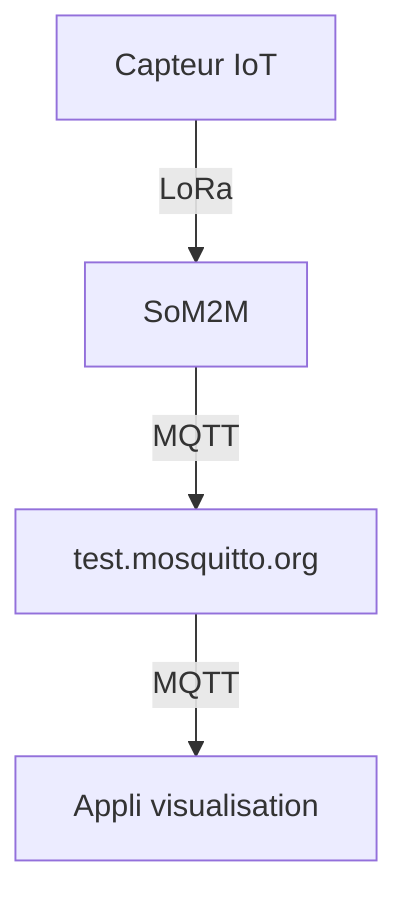
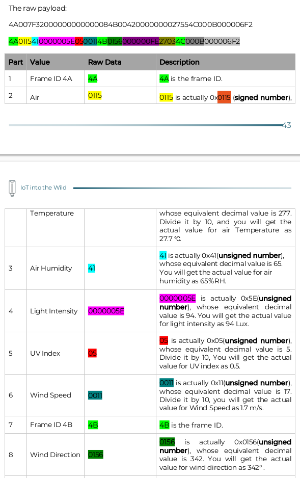

# test_app_iot, goudot
projet IoT goudot démontration...

## Etapes
1) Mettre en place environnement (github, )
2) Connection MQTT (lib paho)
2) S'abonner au topic "cci/SenseCAP"
3) Quand un message arrive, le décoder
4) Afficher les informations du capteur

## Décodage trame
Document SenseCAP S2120 LoRaWAN 8-in-1 Weather Station User Guide.pdf (https://wiki.seeedstudio.com/Getting_Started_with_SenseCAP_S2120_8-in-1_LoRaWAN_Weather_Sensor/) page 44
